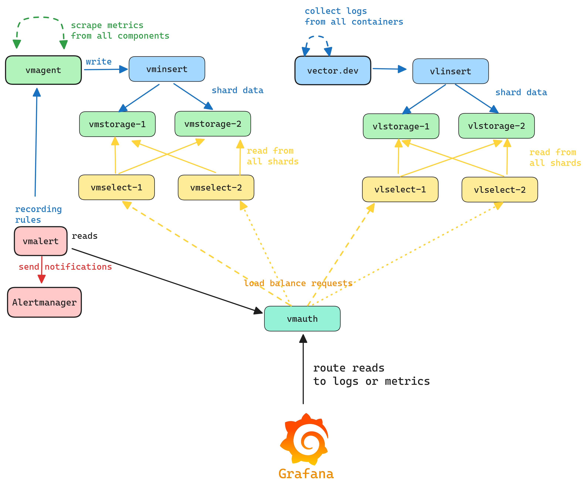

# Docker Monitoring Stack - VictoriaMetrics & VictoriaLogs Cluster

## Overview

A comprehensive monitoring and logging stack built with Docker Compose featuring high-performance VictoriaMetrics and VictoriaLogs clusters. This stack provides:

### Core Components

- **[Grafana](https://github.com/grafana/grafana)**: Advanced dashboarding and visualization
- **[VictoriaMetrics Cluster](https://github.com/VictoriaMetrics/VictoriaMetrics)**: High-performance time-series database (replaces Prometheus)
- **[VictoriaLogs Cluster](https://github.com/VictoriaMetrics/VictoriaMetrics/tree/master/app/victoria-logs)**: Fast log aggregation and search
- **[VMagent](https://github.com/VictoriaMetrics/agent)**: Metrics collection and forwarding
- **[VMAuth](https://github.com/VictoriaMetrics/vmauth)**: Authentication proxy and load balancer
- **[VMAlert](https://docs.victoriametrics.com/vmalert/)**: Alerting and recording rules engine
- **[Alertmanager](https://github.com/prometheus/alertmanager)**: Alert routing and management
- **[Uncomplicated Alert Receiver](https://github.com/jamesread/uncomplicated-alert-receiver)**: Alert management UI

### Data Collection

- **[Node-Exporter](https://github.com/prometheus/node_exporter)**: Host system metrics
- **[cAdvisor](https://github.com/google/cadvisor)**: Container metrics
- **[Vector](https://github.com/vectordotdev/vector)**: High-performance log collector
- **[Log Generator](https://github.com/duyhenryer/log-generator)**: Sample log generation for testing

### Additional Tools

- **[SQL-to-LogsQL](https://github.com/VictoriaMetrics/sql-to-logsql)**: Query VictoriaLogs using SQL syntax


## Architecture

<picture>
  <source srcset="assets/vm-vl-cluster-dark.png" media="(prefers-color-scheme: dark)">
  <source srcset="assets/vm-vl-cluster-light.png" media="(prefers-color-scheme: light)">
  
</picture>


### VictoriaMetrics Cluster

The VictoriaMetrics cluster consists of multiple components for high availability and performance:

- **2x VMInsert** (`vminsert-1`, `vminsert-2`): Handle metrics ingestion
- **2x VMStorage** (`vmstorage-1`, `vmstorage-2`): Store time-series data with 15-day retention
- **2x VMSelect** (`vmselect-1`, `vmselect-2`): Query time-series data.
- **VMAuth**: Authentication proxy and load balancer.

### VictoriaLogs Cluster

The VictoriaLogs cluster provides fast log aggregation and search capabilities:

- **VLInsert**: Handles log ingestion
- **2x VLStorage** (`vlstorage-1`, `vlstorage-2`): Store log data with 4-week retention
- **2x VLSelect** (`vlselect-1`, `vlselect-2`): Query log data 
- **Vector**: High-performance log collector that gathers Docker container logs
- **Log Generator**: Generates sample logs for testing and demonstration

### SQL-to-LogsQL Integration

The SQL-to-LogsQL service provides a familiar SQL interface for querying VictoriaLogs:

```
SQL Query (Browser) → sql-to-logsql:8080
    ↓ (translate SQL → LogsQL)
vmauth:8427 (Basic Auth: admin/changeme)
    ↓ (route /select/logsql/*)
vlselect-1:9471 ⚖️ vlselect-2:9471 (Load Balanced)
    ↓ (query)
vlstorage-1:9491 & vlstorage-2:9491
```

This allows users to query logs using standard SQL syntax instead of learning LogsQL.

## Setup

### Environment Variables

Copy the example environment file:

```bash
cp env.example .env
```

**⚠️ Important**: If you change `VMAUTH_USERNAME` or `VMAUTH_PASSWORD`, you must also update:
1. `configs/vm/auth-vm-cluster.yml`
2. `configs/grafana/provisioning/datasources.yml`


### Bootstrap

Boot the stack with docker compose.

```bash
docker-compose up -d
```

Ensure all containers are running:

```bash
docker-compose ps -a
```

## Access Grafana

Access Grafana on [http://localhost:3000](http://localhost:3000/?orgId=1) and you should see the pre-configured dashboards:

- **Node Metrics**: Host system performance and resource usage
- **Container Metrics**: Docker container performance and health
- **VMagent**: Metrics collection and forwarding status
- **VMAuth**: Authentication proxy and load balancer metrics
- **VMAlert**: Alerting rules and evaluation status
- **VM Cluster**: VictoriaMetrics cluster health and performance
- **VictoriaLogs**: Log aggregation and search metrics
- **VictoriaLogs Cluster**: VictoriaLogs cluster health and performance


## Service Endpoints

The following services are available:

| Service                      | Internal Endpoint                         | External Endpoint     | Description |
| ---------------------------- | ----------------------------------------- |---------------------- | ----------- |
| **Grafana**                  | http://grafana:3000                       | http://localhost:3000 | Main dashboard interface |
| **VMAuth**                   | http://vmauth:8427                        | http://localhost:8427 | Authentication proxy & load balancer |
| **VMagent**                  | http://vmagent:8429                       | http://localhost:8429 | Metrics collection agent |
| **VMAlert**                  | http://vmalert:8880                       | http://localhost:8880 | Alerting rules engine |
| **Alertmanager**             | http://alertmanager:9093                  | http://localhost:9093 | Alert routing & management |
| **Alert Receiver**           | http://uncomplicated-alert-receiver:9094  | http://localhost:9094 | Alert management UI |
| **SQL-to-LogsQL**            | http://sql-to-logsql:8080                 | http://localhost:8080 | SQL interface for logs |
| **Node-Exporter**            | http://node-exporter:9100                 | N/A                   | Host metrics (internal) |
| **cAdvisor**                 | http://cadvisor:8080                      | N/A                   | Container metrics (internal) |
| **Vector**                   | http://vector:8686                        | N/A                   | Log collector (healthcheck) |
| **Vector Metrics**           | http://vector:9598                        | N/A                   | Vector metrics (internal) |
| **Log Generator**            | N/A                                       | N/A                   | Sample log generation (internal) |

## Cleanup

To remove the containers using docker compose (or `make clean`):

```bash
docker-compose down
```

To remove containers and volumes (complete cleanup):

```bash
docker-compose down -v
```